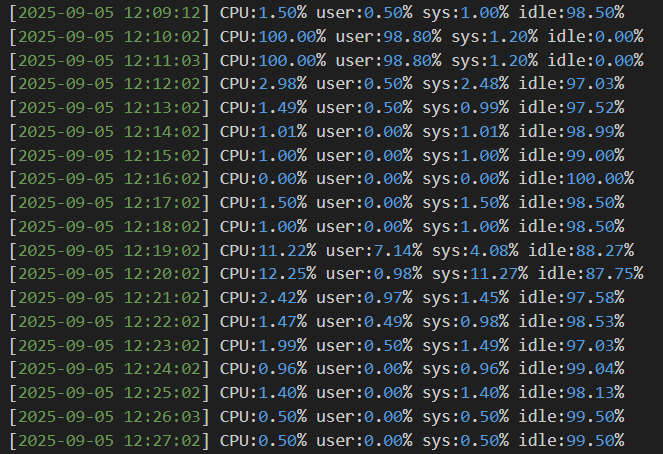
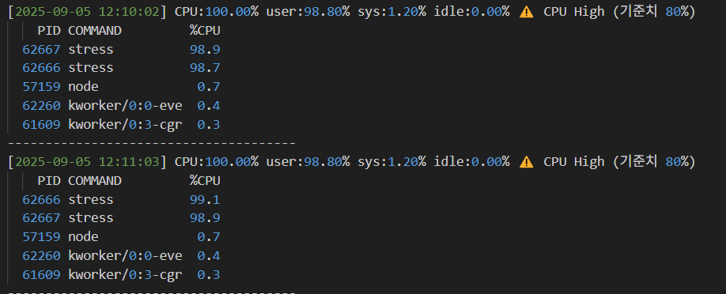
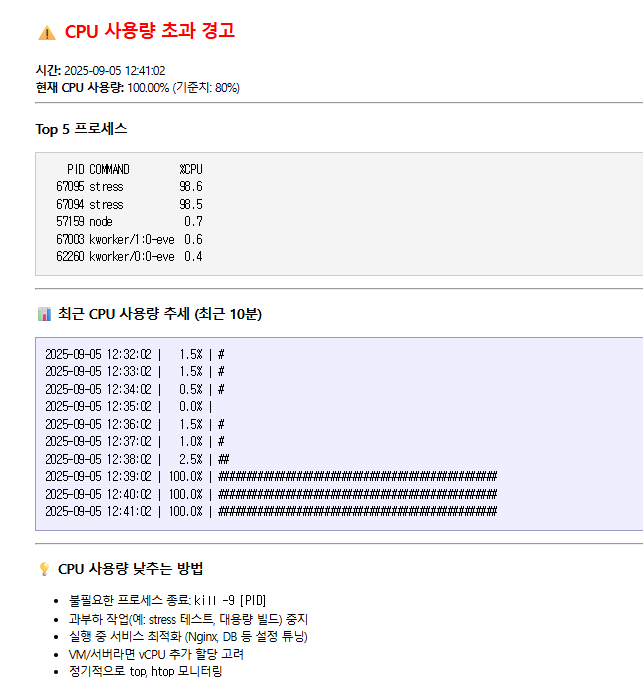

# CPU Monitor & Alert System

> Ubuntu 환경에서 `sar`, `awk`, `cron`, `msmtp`를 활용해 CPU 사용량을 모니터링하고,
기준치를 초과하면 로그와 함께 **경고 메일**을 자동 발송하는 시스템을 구축했습니다.

### 주요 특징
- cron을 활용해 주기적으로 CPU 사용량 측정

- `awk`로 로그 정제 및 추세 그래프 생성

- `msmtp`를 이용한 네이버 SMTP 기반 메일 전송

---

## **팀원 소개**

|  |  |
| -------------------------------------------------------------------------------- | -------------------------------------------------------------------------------- |
| [임유진](https://github.com/imewuzin)                                         | [이용훈](https://github.com/dldydgns)                                         |

---

## 시스템 구성

| 구성 요소                  | 역할                    |
| ---------------------- | --------------------- |
| **sar (sysstat)**      | CPU 사용량 수집            |
| **awk**                | 로그 파싱 및 추세 그래프 생성     |
| **cron**               | 1분 단위 자동 실행           |
| **msmtp (Naver SMTP)** | 알림 메일 발송              |
| **Ubuntu (v24.04.2)**  | 실행 환경 (VirtualBox VM) |

---

 ## 설치 및 설정 절차

### ① 필수 패키지 설치

```bash
sudo apt update
sudo apt install -y sysstat msmtp msmtp-mta bc
```

### ② msmtp 설정

- `~/.msmtprc` 파일 작성 (Naver 기준)

    ```ini
    defaults
    auth on
    tls on
    tls_starttls on
    tls_trust_file /etc/ssl/certs/ca-certificates.crt
    logfile ~/.msmtp.log

    account naver
    host smtp.naver.com
    port 587
    from yourid@naver.com
    user yourid@naver.com
    password 발급받은앱비밀번호

    account default : naver
    ```

- 권한 설정

    ```bash
    chmod 600 ~/.msmtprc
    ```

### ③ CPU 모니터링 스크립트 작성

- `cpu_monitor.sh`:

    | 구성 요소           | 설명                                                                                                                                |
    | --------------- | --------------------------------------------------------------------------------------------------------------------------------- |
    | **환경 변수 설정**    | 로그 저장 경로(`cpu_usage.log`, `cpu_alert.log`), 기준치(80%) 지정                                                                           |
    | **CPU 측정**      | `sar -u 1 1` 결과에서 평균 CPU 사용률 추출                                                                                                   |
    | **로그 기록**       | 모든 측정 결과를 `cpu_usage.log`에 저장                                                                                                     |
    | **임계치 비교**      | `awk`, `bc`를 사용해 CPU 사용량이 기준치 초과 여부 확인                                                                                            |
    | **경고 처리**       | 초과 시 `cpu_alert.log`에 기록                                                                                                          |
    | **Top 프로세스 확인** | `ps` 명령어로 상위 5개 CPU 점유 프로세스 기록                                                                                                    |
    | **추세 그래프 생성**   | 최근 10분 CPU 사용량을 ASCII 그래프로 변환 (시간 포함)                                                                                             |
    | **메일 전송**       | `msmtp`를 통해 네이버 SMTP 서버로 알림 메일 발송<br> - 제목: “⚠️ CPU 사용량 초과 알림 - \[시간]”<br> - 본문: 현재 CPU 사용량, Top 5 프로세스, 최근 10분 추세, CPU 낮추는 방법 안내 |


### ④ 실행 권한 및 테스트

```bash
chmod +x cpu_monitor.sh
./cpu_monitor.sh
```

### ⑤ cron 등록

```bash
crontab -e
```

- 추가

    ```
    * * * * * /파일경로/cpu_monitor.sh
    ```


### ⑥ CPU 부하 테스트

```bash
stress --cpu 2 --timeout 120s
```

* `cpu_usage.log` → 모든 CPU 사용량 기록
* `cpu_alert.log` → 기준치 초과 시 경고 기록
* 네이버 메일 → 경고 메일 수신

---

## 결과

#### cpu_usage.log


#### cpu_alert.log


#### 메일




---

## 트러블슈팅

1. **cron 로그가 안 쌓일 때**

   * `chmod +x cpu_monitor.sh` 권한 문제 확인
   * `grep CRON /var/log/syslog` 확인


---

## 회고

**임유진**
> 구현 과정에서 msmtp 인증 오류와 cron 실행 문제를 해결하며 리눅스 환경에서의 보안 설정과 자동화 개념을 이해하게 되었다. 이번 경험을 통해 앞으로는 이런 개별 기능 구현에 그치지 않고, 리눅스 전반에 대한 학습을 더욱 체계적으로 이어가야겠다고 느꼈다.

**이용훈**
